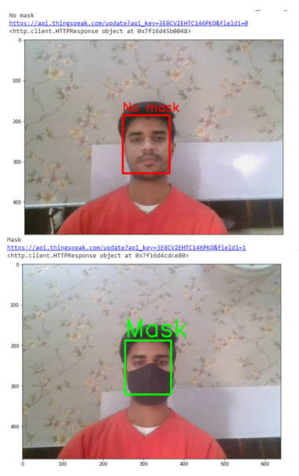

# IoT-Based-Smart-Hand-Sanitizer-Dispencer-(COVID-19)-

Paper available at : https://drive.google.com/file/d/1qcUOE-HdOTZPRiFFslAAejRB80ydhQt0/view?usp=sharing
## Datasets 
1.https://drive.google.com/drive/folders/1fs2-vaO2T01V-g6w6l18tQD0tuI7fmtS?usp=sharing

## Tinkercad
https://www.tinkercad.com/things/33GHexLPtPE

## Colab link
https://colab.research.google.com/drive/1FkY34IKlSJQih96nu9Ny3J6Twz1T3emY?usp=sharing

-  
schematic diagram of IOT based smart contactless hand sanitizer dispenser
-  
3D printed model of the dispenser with camera, ultrasonic sensor, temperature sensor and nozzle
-  
Schematic of the Convolutional Neural network (CNN)
-  
Epochs vs Loss
-  
Epochs vs Accuracy
-  
Face mask detection 
-  
Block diagram for sending data to Thingspeak
-  
Software and their different channels reading.
